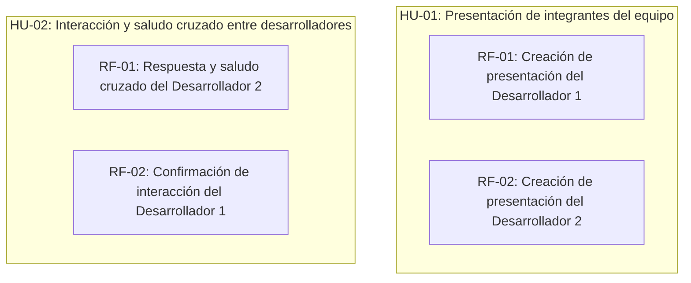

# Grafo de Dependencias -- pruebaBlanco

_Generado automaticamente el 2026-08-20T14:09:47.064Z -- no editar a mano, se sobreescribe en cada publicacion._

```mermaid
graph TD
  subgraph US_1787232428829["HU-01: Presentación de integrantes del equipo"]
    REQ_1787233575852["RF-01: Creación de presentación del Desarrollador 1"]
    REQ_1787233583344["RF-02: Creación de presentación del Desarrollador 2"]
  end
  subgraph US_1787232434275["HU-02: Interacción y saludo cruzado entre desarrolladores"]
    REQ_1787233593724["RF-01: Respuesta y saludo cruzado del Desarrollador 2"]
    REQ_1787233602143["RF-02: Confirmación de interacción del Desarrollador 1"]
  end
```